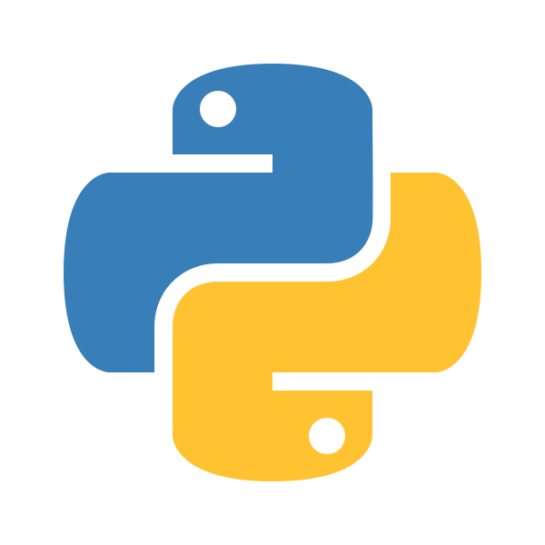
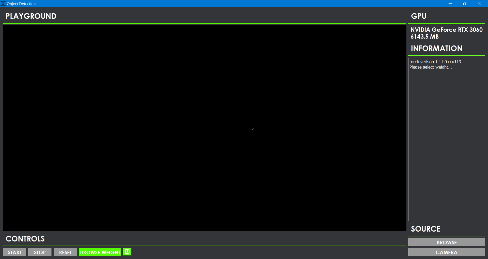
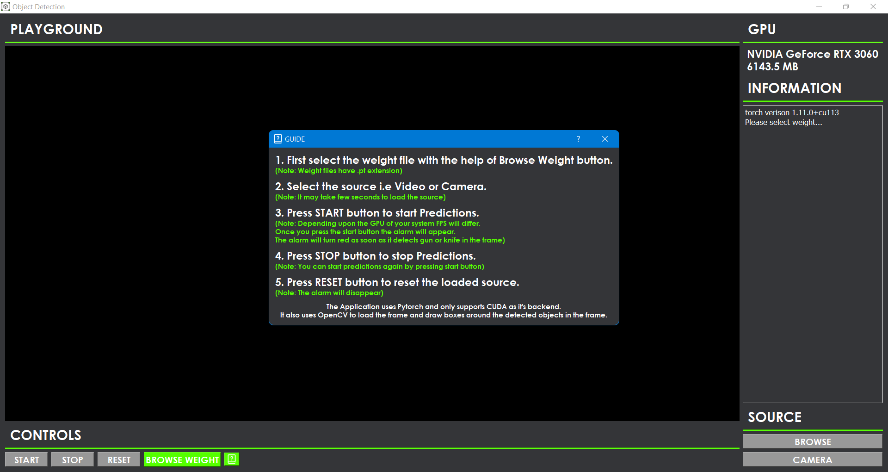
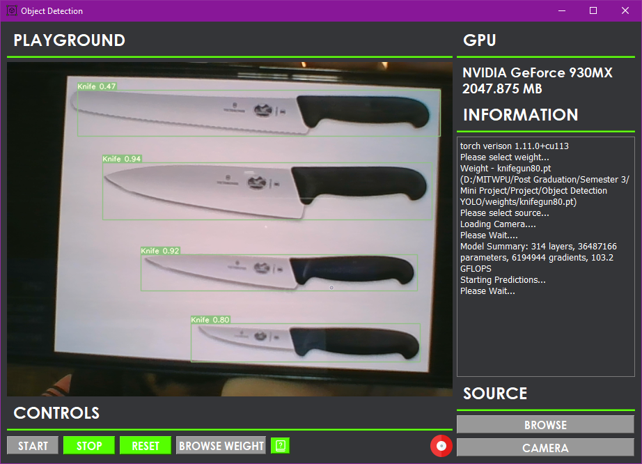
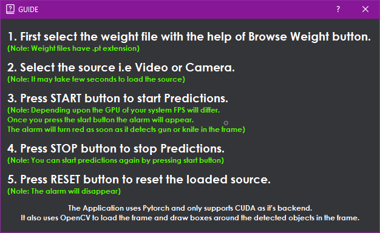

# Object Detection
* The primary aim of this project was to build an application which can help us detect arms like guns and knives but we can also use this application to detect other objects as well.
* The application uses YOLOv7 algorithm to detect various objects in the frame.
* The backend of the application uses PyTorch, OpenCV. The whole algorithm is executed with the help of PyTorch. To read the frame and draw boxes around the objects it uses OpenCV.
(Note: This application only supports CUDA as the backend of the PyTorch)
* For the GUI of the application it uses PyQT5.
* It also uses twilio API to send signals in the form of messages to the concerned person once we identify Gun or Knife in the frame.
(Note: Alarm functionality will not work on pre-trained weights)

# Training
* For training, we have used 1500 images of Gun and Knife each and for validation we have have used 238 images of Gun and Knife each.
* Before training the model we generated .txt file (label file) for every image in the dataset with the help of labelImg application. This .txt file contains x, y, width, height and class of the image.
* weights folder contains 2 pre-trained weights and 4 trained weights. The pre-trained weights are yolov7.pt and yolov7-tiny.pt.
* The code for training is present in the train branch.

# Running
* First install python and do pip install requirements.txt and gpu_requirements.txt the from command line to install all the dependencies.
* Open command prompt run the main.py file.
* Browse the weight and click on camera to open the camera or else click on browse to open video.
* Press start to start the predictions.

# Technologies Used

  
   
  
  
  
  

# Screen Shots

  
   

  
   

# Links
* Python - https://www.python.org/
* PyTorch - https://pytorch.org/
* OpenCV - https://opencv.org/
* PyQT - https://riverbankcomputing.com/software/pyqt/
* Twilio - https://www.twilio.com/
* labelImg - https://github.com/heartexlabs/labelImg

# References
* This project took references from the Official YOLOv7 GitHub Repository
* YOLOv7 - https://github.com/WongKinYiu/yolov7